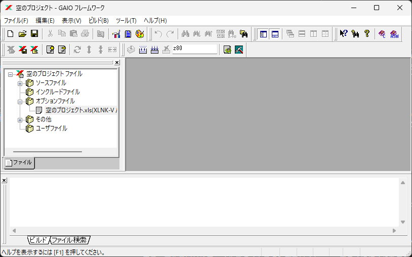

# 秋月電子で売っている Z80用 Cコンパイラ XCC-Vの使い方
秋月電子で 1,000円で売っている [AKI-80用モニターROM&Cコンパイラーセット (101578)](https://akizukidenshi.com/catalog/g/g101578/) 
がどんなものだろうと気になって購入してみたのですが、CP/M用のスタートアッププログラムが付属していないのと、
マニュアルが windowsのヘルプ形式で読みにくいのが面倒で何年も使わずにいました。
最近時間ができて使ってみると C言語からアセンブラで書いたプログラムを呼び出すのも簡単で便利に使うことができたので、
コンパイラに付属している標準ライブラリを CP/M / MSX-DOS上で動くようにして、
文字表示、ファイルの読み書きを行ってみた様子を書きます。

CP/M上で動く Cコンパイラを使ったセルフ開発のように識別子の長さに厳しい制限があったり、
C言語の仕様が古かったりしない ANSI Cで、マニュアルも日本語なので使いやすいです。

このコンパイラは 2025年現在も秋月電子で購入することができます。

## 目次
1. [このコンパイラ XCC-Vについて](#このコンパイラ-XCC-Vについて)
1. [使い始める前に](#使い始める前に)
1. [とりあえず使ってみる](#とりあえず使ってみる)
1. [コンパイル - アセンブル - リンクの方法](#コンパイル---アセンブル---リンクの方法)
1. [この文章のライセンス](#ライセンス)

## このコンパイラ XCC-Vについて
付属のマニュアルによると、ガイオテクノロジー社製の i8086や MC68000や H8や ARMや Z80など多くのプロセッサに対応した組み込み向けクロスコンパイラで、それを Z80だけに機能を限定して秋月電子がキットに付属する無償版という扱いのようです。

マニュアルの日付やファイルのタイムスタンプを見ると 1998年ころに作られたコンパイラて、2005年に更新された版になっていました。

## 使い始める前に
### Windows 11での動作


Windows 11でもインストールは問題無く行うことができましたが、もともと Windows98時代のソフトウェアなので、Windows 11で GAIOフレームワーク (IDE) 
を少し使ってみると、ファイルが消えたり、IDEが異常終了したりと動作が不安定でした。

けれども、コンパイラやアセンブラやリンカなど必要なツールは IDEを使用しなくても、
すべてターミナル（コマンドライン）で問題なく使用できるので、ターミナルで使用することにしました。
VS Codeのターミナルで使うと快適です。

### マニュアルについて
付属のマニュアルが windowsのヘルプ形式で読みにくいのですが、Internet Archiveに 
[PDF版のマニュアル](https://archive.org/details/z-80-c/C%E3%82%B3%E3%83%B3%E3%83%91%E3%82%A4%E3%83%A9%20XCC-V%20%E4%BD%BF%E7%94%A8%E6%89%8B%E5%BC%95%E3%81%8D/)
があるので、PDF版のマニュアルをダウンロードして読むと便利です。

とりあえず Cコンパイラを使用してみる場合、
コンパイラとアセンブラの Z80固有仕様の部分を読んでおけば使い始めることができます。
その他の部分は必要に応じて読む感じで十分。
C言語でプログラムを書くだけなら、マクロプロセッサのマニュアルは読む必要はありません。
IDEも使わないので、IDE（GAIOフレームワーク）のマニュアルも読まなくて良いです。

## とりあえず使ってみる
まず試しに、ごく簡単なプログラムをコンパイルして出力されるアセンブリソースを眺めてみます。

tutorial_1.c
```
int func1(int a, int b)
{
    return a + b;
}

int main()
{
    int a, b;

    a = 123;
    b = 456;
    
    a = func1(a, b);
}
```

### コンパイル
コンパイラに makeが付属していないので、バッチファイルを作ってコンパイルすることにします。

build.bat
```
REM XCCVをインストールしたフォルダを指定
SET XCC_PATH=C:\akiz80\

REM 環境変数をセット
REM （バッチファイル内でセットした環境変数は、バッチファイルの処理が終了すると破棄される）
SET PATH=%PATH%;%XCC_PATH%bin\
SET XCC_DEFINE=%XCC_PATH%GEN\CXGZE1.XCO
SET XCC_INCLUDE=%XCC_PATH%INCLUDE\
SET XAS_DEFINE=%XCC_PATH%GEN\VXGZE1.XGO
SET XAS_ERRMSG=%XCC_PATH%BIN\XASMSG.SJIS
SET XAS_LIB=%XCC_PATH%LIB\z80\
SET XAS_CODE=sjis
SET XAS_MPUNAME=z80

REM コンパイル
xccv tutorial_1.c -d -w -LW1 -LE2 -ks
```

バッチファイルでコンパイルすると、動作に必要な環境変数をシステムに追加しなくて良いので簡単です。
（バッチファイル内でセットした環境変数はそのバッチファイルが終了すると破棄されるので、
環境を汚さずに済みます。）

ターミナルで
```
> ./build
```
と入力して、このバッチファイルを実行すると C言語のソースコードがコンパイルされて、
アセンブリのソースファイル `"tutorial_1.xas"` が出力されます。


VS Codeの使い方は、Windowsの Copilotに質問すれば教えてくれます。

#### tutorial_1.xas
Cコンパイラが出力した、アセンブルソースを眺めてみます。

```
%%TOOL	  'xcc-v V10.07	 5a12' ,250130211751
%%COMPILE language=C , source=tutorial_1,cps=2,dps=2
;	Cross C	Compiler  XCC-V	 V10.07	(5a12) -08010000:0000-
;		== Z80 (V07.02)	5430 ==		
                global	_func1
                global	_main
%%BFILE	  'C:\Users\uts\OneDrive\Documents\program\Z80\XCC-V_1\tutorial_1.c' ,250127204043,29
C_tutorial_1		sect	code
（略）
%%FUNC	  func1,3,cls=2,type=5
_func1:
                push	IX
                ld	IX,0
                add	IX,SP
%%DFP	  2
%%SYM	  a,14,type=5,cls=6,val=4,size=2
%%SYM	  b,14,type=5,cls=6,val=6,size=2
%%ENDD	  
%%BF	  
; - return -
%%LINE	  000018
;Expr(18): a+ b	
                ld	E,(IX+6)
                ld	D,(IX+7)
                ld	L,(IX+4)
                ld	H,(IX+5)
                add	HL,DE
                ld	B,H
                ld	C,L
                jr.x	L1
%%LINE	  000019
; RET
L1:
%%EF	  
                ld	SP,IX
                pop	IX
                ret
%%FEND	  
;	b -> offset 6	 int
;	a -> offset 4	 int
%%LINE	  000022
%%FUNC	  main,3,cls=2,type=5
_main:
                push	IX
                ld	IX,0
                add	IX,SP
                push	HL
                push	HL
%%BF	  
%%SYM	  a,0,type=5,cls=6,val=-2,size=2
;	a -> -2	(0fffeh)	 int
%%SYM	  b,0,type=5,cls=6,val=-4,size=2
;	b -> -4	(0fffch)	 int
%%LINE	  000025
;Expr(25): a=123	
                ld	(IX-2),123
                ld	(IX-1),0
%%LINE	  000026
;Expr(26): b=456	
                ld	(IX-4),200
                ld	(IX-3),1
%%LINE	  000028
;Expr(28): a=func1(a,b)	
                ld	C,(IX-4)
                ld	B,(IX-3)
                push	BC
                ld	E,(IX-2)
                ld	D,(IX-1)
                push	DE
                call	_func1
                ld	(IX-2),C
                ld	(IX-1),B
%%LINE	  000029
%%EF	  
                ld	SP,IX
                pop	IX
                ret
%%FEND	  
;	a -> offset -2	 int
;	b -> offset -4	 int
%%EFILE	  
                end	_main
```

このようにインデックスレジスタを使って関数の引数にアクセスしているなとか、
足し算してるなとか、けっこうわかりやすい Z80のアセンブリコードになっています。

## コンパイル - アセンブル - リンクの方法
続いて、コンパイル - アセンブル - リンクを実行して実行可能なバイナリ情報を出力させてみます。

### リンクパラメータファイルの作成
どのオブジェクトをリンクして、どのアドレスに配置するのかということを
「リンクパラメータファイル "\*.xls"」に記述してリンカに指示します。

コンパイラをインストールすると、サンプルが "C:\akiz80\LIB\z80\STARTUP\EXAMPLE.XLS"
に置かれていますので、リンクするオブジェクト名の所だけを編集してサンプルをこのまま使います。
とりあえずビルドしてみるだけで、まだ実行はしないのでアドレスはサンプルのまま変更しません。

#### tutorial_1.xls
```
; リンクパラメータファイル
; "C:\akiz80\LIB\z80\STARTUP\EXAMPLE.XLS" にあるサンプルを
; リンクするモジュール名だけを編集してそのまま

;-------------------------------+
;       RAM Area                |
;-------------------------------+
/ADDR=1000    ; 変数やスタックのようなデータを配置する RAMのアドレス
/SECT=D_*|COMM		(data	=_DATA)
/SECT=B_*|COMM		(bss	=_BSS)
/SECT=_STACK
;-------------------------------+
;       ROM Area                |
;-------------------------------+
/ADDR=8000    ; コードや変数の初期値を配置する ROMのアドレス
/SECT=C_*|CODE
/SECT=I_*
;-------------------------------+
;       init data section       +
;-------------------------------+
/init_section = _INIT_DATA	(_DATA)
;-------------------------------+
;       linkage module          |
;-------------------------------+
/name = tutorial_1  ; 出力オブジェクト名
/modl = tutorial_1  ; 入力モジュール名（アセンブラが出力したモジュール）
```
アセンブラのマニュアルにリンカのマニュアルも含まれていて、詳しい説明があるので読んでください。

### ビルドバッチファイルの作成
コンパイルだけをしてみた時に使ったバッチファイルに追記して、アセンブル、リンク、
出力オブジェクトの変換を行うようにします。

コンパイラやアセンブラなどのコマンドラインオプションは、
IDEのビルドの設定で見ることができるコマンドラインオプションをそのまま指定しました。
付属のマニュアルに詳細説明があるので、必要に応じて読みます。

#### build.bat
```
REM XCCVをインストールしたフォルダを指定
SET XCC_PATH=C:\akiz80\

REM 環境変数をセット
REM （バッチファイル内でセットした環境変数は、バッチファイルの処理が終了すると破棄される）
SET PATH=%PATH%;%XCC_PATH%bin\
SET XCC_DEFINE=%XCC_PATH%GEN\CXGZE1.XCO
SET XCC_INCLUDE=%XCC_PATH%INCLUDE\
SET XAS_DEFINE=%XCC_PATH%GEN\VXGZE1.XGO
SET XAS_ERRMSG=%XCC_PATH%BIN\XASMSG.SJIS
SET XAS_LIB=%XCC_PATH%LIB\z80\
SET XAS_CODE=sjis
SET XAS_MPUNAME=z80

REM コンパイル
xccv tutorial_1.c -d -w -LW1 -LE2 -ks

REM アセンブル
xassv tutorial_1.xas -da -a -r

REM リンク（リンク情報は .xlsファイルに記述する）
xlnkv tutorial_1.xls -l -m -d -s -o -p

REM 出力オブジェクトをインテルHEX形式に変換
xoutv tutorial_1.xlo -d -t obj1,sym1 -l 
```

アセンブル、リンク、出力オブジェクトの変換を追加しました。

### ビルドの実行
`build.bat` を実行すればビルドされます。

### ビルド後に出力されるファイル
#### Cコンパイラが出力するアセンブルソースファイル \*.xas
```
%%TOOL	  'xcc-v V10.07	 5a12' ,250130211751
%%COMPILE language=C , source=tutorial_1,cps=2,dps=2
;	Cross C	Compiler  XCC-V	 V10.07	(5a12) -08010000:0000-
;		== Z80 (V07.02)	5430 ==		
                global	_func1
                global	_main
%%BFILE	  'C:\Users\uts\OneDrive\Documents\program\Z80\XCC-V1\tutorial_1.c' ,250127204043,29
C_tutorial_1		sect	code
（略）
%%FUNC	  func1,3,cls=2,type=5
_func1:
                push	IX
                ld	IX,0
                add	IX,SP
%%DFP	  2
%%SYM	  a,14,type=5,cls=6,val=4,size=2
%%SYM	  b,14,type=5,cls=6,val=6,size=2
%%ENDD	  
%%BF	  
; - return -
%%LINE	  000018
;Expr(18): a+ b	
                ld	E,(IX+6)
                ld	D,(IX+7)
                ld	L,(IX+4)
                ld	H,(IX+5)
                add	HL,DE
                ld	B,H
                ld	C,L
                jr.x	L1
%%LINE	  000019
; RET
L1:
%%EF	  
                ld	SP,IX
                pop	IX
                ret
%%FEND	  
;	b -> offset 6	 int
;	a -> offset 4	 int
%%LINE	  000022
%%FUNC	  main,3,cls=2,type=5
_main:
                push	IX
                ld	IX,0
                add	IX,SP
                push	HL
                push	HL
%%BF	  
%%SYM	  a,0,type=5,cls=6,val=-2,size=2
;	a -> -2	(0fffeh)	 int
%%SYM	  b,0,type=5,cls=6,val=-4,size=2
;	b -> -4	(0fffch)	 int
%%LINE	  000025
;Expr(25): a=123	
                ld	(IX-2),123
                ld	(IX-1),0
%%LINE	  000026
;Expr(26): b=456	
                ld	(IX-4),200
                ld	(IX-3),1
%%LINE	  000028
;Expr(28): a=func1(a,b)	
                ld	C,(IX-4)
                ld	B,(IX-3)
                push	BC
                ld	E,(IX-2)
                ld	D,(IX-1)
                push	DE
                call	_func1
                ld	(IX-2),C
                ld	(IX-1),B
%%LINE	  000029
%%EF	  
                ld	SP,IX
                pop	IX
                ret
%%FEND	  
;	a -> offset -2	 int
;	b -> offset -4	 int
%%EFILE	  
                end	_main
```

#### アセンブラが出力するリストファイル \*.lis
```
（略）
   CROSS ASSEMBLER     V10-L33   (5405)  XASS-V                                           Thu 30-Jan-2025 21:17:51      PAGE-0002
											              Z80               0702
Addr     Location Object-Code	   RE Isn  Source Statement  [ ******                         ]				    Error
  		  1 2 3 4 5 6 7 8	   ....*....1....*....2....*....3....*....4....*....5....*....6....*....7....*....8
                  		      0054 ;	   a -> offset 4    int							   
                  		      0055 %%LINE    000022								   
                  		      0056 %%FUNC    main,3,cls=2,type=5						   
                  		      0057 _main:									   
         0000001E DDE5		      0058 		   push	   IX							   
00000000 00000020 DD210000	      0059 		   ld	   IX,0							   
         00000024 DD39		      0060 		   add	   IX,SP						   
         00000026 E5		      0061 		   push	   HL							   
         00000027 E5		      0062 		   push	   HL							   
                  		      0063 %%BF	     									   
                  		      0064 %%SYM     a,0,type=5,cls=6,val=-2,size=2					   
                  		      0065 ;	   a -> -2 (0fffeh)	    int						   
                  		      0066 %%SYM     b,0,type=5,cls=6,val=-4,size=2					   
                  		      0067 ;	   b -> -4 (0fffch)	    int						   
                  		      0068 %%LINE    000025								   
                  		      0069 ;Expr(25): a=123	   							   
         00000028 DD36FE7B	      0070 		   ld	   (IX-2),123						   
         0000002C DD36FF00	      0071 		   ld	   (IX-1),0						   
                  		      0072 %%LINE    000026								   
                  		      0073 ;Expr(26): b=456	   							   
         00000030 DD36FCC8	      0074 		   ld	   (IX-4),200						   
         00000034 DD36FD01	      0075 		   ld	   (IX-3),1						   
                  		      0076 %%LINE    000028								   
                  		      0077 ;Expr(28): a=func1(a,b) 							   
         00000038 DD4EFC	      0078 		   ld	   C,(IX-4)						   
         0000003B DD46FD	      0079 		   ld	   B,(IX-3)						   
         0000003E C5		      0080 		   push	   BC							   
         0000003F DD5EFE	      0081 		   ld	   E,(IX-2)						   
         00000042 DD56FF	      0082 		   ld	   D,(IX-1)						   
         00000045 D5		      0083 		   push	   DE							   
00000000 00000046 CD0000	   R  0084 		   call	   _func1						   
         00000049 DD71FE	      0085 		   ld	   (IX-2),C						   
         0000004C DD70FF	      0086 		   ld	   (IX-1),B						   
                  		      0087 %%LINE    000029								   
                  		      0088 %%EF	     									   
         0000004F DDF9		      0089 		   ld	   SP,IX						   
         00000051 DDE1		      0090 		   pop	   IX							   
         00000053 C9		      0091 		   ret								   
                  		      0092 %%FEND    									   
                  		      0093 ;	   a -> offset -2   int							   
                  		      0094 ;	   b -> offset -4   int							   
                  		      0095 %%EFILE   									   
         00000054 		      0096 		   end	   _main						   
（略）
```

#### グローバルリスト情報ファイル \*.gst
```
; MODULE_NAME = tutorial_1
_FUNC1 REAL 8000:0 54
_MAIN REAL 8000:1e 54
```

#### リンケージマップ情報ファイル \*.map

```
（略）
					+-----------------------+
					|  Linkage Information  |
					+-----------------------+

Unit Name         Section Name     Sec.Type Mode  Location(Byte)    Size        Location(Word)    Size      
----------------  ---------------- -------- ----  ----------------- ----------  ----------------- ----------
tutorial_1        C_TUTORIAL_1     Code     Rel   00008000/00008053 (00000084)  00008000/00008053 (00000084)


Linked Module    Mode     File
---------------- ------   ----
tutorial_1       Abs_lm   tutorial_1.xlo

   CROSS LINKER        V11-L08   (2507)  XLNK-V           LINKAGE LIST                    Thu 30-Jan-2025 21:17:51       PAGE-0004


					+-------------------------+
					|  Global Reference List  |
					+-------------------------+

No   Unit Name   Global.Symbol    Location   External Information (Unit.no/Location)      
---- ----------- ---------------- --------   -----------------------------------------    
0001 tutorial_1  _FUNC1           00008000   
                 _MAIN            0000801e   


```

#### リスト情報ファイル \*.inf
```
（略）
  +--------------------------+  
  | Convert Obj Information  |
  +--------------------------+  

        File-Spec : tutorial_1.xho

        Program Entry Address 
        --------------------- 
        Byte addr : 0000801E  Word addr : 0000801E

        Section     Entry     Size (Byte) 
        -------     -----     ----------- 
        Code        00008000  00000054 (000000.08KB)
        Common      00000000  00000000 (000000.00KB)
        Stack       00000000  00000000 (000000.00KB)
        -------------------------------------------- 
        Total                 00000054   

        Object Format
        -------------
        Intel hex Format ( 8bit )   

  +--------------------------+  
  | Output Section           |
  +--------------------------+  

        Number Section name     Type   Word Location       Size                 Byte Location       Size
        ------ ---------------- ------ ------------------- -------------------  ------------------- -------------------
        0001   C_TUTORIAL_1     Code   00008000 - 00008053 00000054 (00000084)  00008000 - 00008053 00000054 (00000084)


   CROSS OUTUTILITY    V10-L24   (3c01)  XOUT-V  INFORMATION LIST                        Thu 30-Jan-2025 21:17:52       PAGE-0002

  +--------------------------+  
  | Symbol Table Information |
  +--------------------------+  

        File-Spec : No Output

        Attribute             Count   Select 
        ---------             -----   ------ 
        Section  (Sect)           0        0
        Variable (Data)           2        0
        Number   (Abs )           0        0
        Label    (Text)           2        2
        Exception                 2        0
        --------------------------------------
        Total                     6        2
        Error                     0   

        Symbol Table Format
        -------------------
        8 bit Standard Format

        Error Symbol Table
        ------------------
        No fatal caution(s)

```
#### アセンブラが出力するオブジェクトファイル \*.xao
リンカに入力します。

#### リンカが出力するオブジェクトファイル \*.xlo
コンパイラに付属している xoutvで HEXプログラムファイルに変換して利用します。

#### HEXプログラムファイル \*.xho
```
:20800000DDE5DD210000DD39DD5E06DD5607DD6E04DD660519444D1800DDF9DDE1C9DDE597
:20802000DD210000DD39E5E5DD36FE7BDD36FF00DD36FCC8DD36FD01DD4EFCDD46FDC5DDF3
:148040005EFEDD56FFD5CD0080DD71FEDD70FFDDF9DDE1C987
:00000001FF
```
組み込みマイコンでよく使われる [IntelHex](https://ja.wikipedia.org/wiki/Intel_HEX)形式になってるので、
ROMライタで書き込んだり、CP/Mの LOADコマンドで COM形式の実行ファイル変換するなどして利用します。
[Motorola S-record](https://ja.wikipedia.org/wiki/S-record)形式で出力させることもできます。

## スタートアッププログラムの作成
ビルドの方法が分かったので、アセンブリで main関数を呼び出すスタートアッププログラムを用意して実際に実行できるオブジェクトを出力させてみます。

`"C:\akiz80\LIB\z80\STARTUP\STARTUP.XAS"` にスタートアッププログラムのサンプルがありますので、これをそのまま使います。

Cコンパイラのマニュアルの MPU固有の仕様のところに、main関数の起動 - スタートアッププログラムの例がわかりやすく記載されています。

#### startup.xas
```
; XCC-V Z80
; スタートアップルーチン

        GLOBAL  _STACK_END

;********************************************************
;*              Startup Program for Z80                 *
;********************************************************
;-------------------------------+
;       Stack   (RAM)           + スタックセクションの定義
;-------------------------------+
_STACK          sect    stak
        ds      300h    ; スタックサイズ
                        ; ローカル変数にスタックを使うので、多めに確保しておく）
_STACK_END:
;-------------------------------+
;       init section    (ROM)   + 初期値格納用のセクションの定義
;-------------------------------+
_INIT_DATA      sect    comm
;-------------------------------+
;       Control data    (RAM)   + ライブラリ用の変数の定義
;-------------------------------+
D_DATA          sect    comm
        global  _errno
_errno  dw      0               ;for math lib  エラー番号設定領域
                                ; C言語の算術ライブラリで使用する

;=======================================+
;       startup routine (ROM)           +
;=======================================+
C_start         sect    code
_start:
        ld      HL,_STACK_END           ;Set Stack Pointer  スタックポインタの設定
        ld      SP,HL
;*** init PORT,TIMER,...etc
;       :
;       :
;================= clear BSS ==================== 初期値のない変数領域のクリア
        extnal  _BSS_TOP,_BSS_SIZE
        ld      A,0
        ld      DE,_BSS_TOP
        ld      HL,_BSS_SIZE
        ld      BC,0
        or      A
        adc     HL,BC
        jr      z,L110$
        dec     BC
L100$:
        ld      (DE),A
        inc     DE
        or      A
        adc     HL,BC
        jr      nz,L100$
L110$:
;================= init DATA ==================== 初期値のある変数の初期値データのコピー
        extnal  _DATA_TOP,_DATA_SIZE
        ld      HL,_INIT_DATA
        ld      DE,_DATA_TOP
        ld      BC,_DATA_SIZE
        ld      A,B
        or      C
        jr      z,L210$
L200$:
        ldi
        jp      pe,L200$
L210$:
;*** call main ***  main 関数の起動
        extnal  _main
        call    _main	; main関数実行
300$:
        jr      300$
        end     _start
```
IDEでプロジェクトを作成してもスタートアッププログラムを自動で作成してくれないので、自分で書かなきゃいけないのかと思っていたのですが、サンプルが付属していてそのまま使うことができました。

"startup.xas" ファイルが増えたので、これをアセンブル、リンクするようにバッチファイルとリンクパラメータファイルを修正します。

#### build.bat
```
@echo off
REM XCC-Vでプロジェクトをビルドするバッチファイル

REM XCCVをインストールしたフォルダを指定
SET XCC_PATH=C:\akiz80\

REM 環境変数をセット
REM （バッチファイル内でセットした環境変数は、バッチファイルの処理が終了すると破棄される）
SET PATH=%PATH%;%XCC_PATH%bin\
SET XCC_DEFINE=%XCC_PATH%GEN\CXGZE1.XCO
SET XCC_INCLUDE=%XCC_PATH%INCLUDE\
SET XAS_DEFINE=%XCC_PATH%GEN\VXGZE1.XGO
SET XAS_ERRMSG=%XCC_PATH%BIN\XASMSG.SJIS
SET XAS_LIB=%XCC_PATH%LIB\z80\
SET XAS_CODE=sjis
SET XAS_MPUNAME=z80

REM コンパイル
xccv tutorial_1.c -d -w -LW1 -LE2 -ks

REM アセンブル
xassv startup.xas -da -a -r
xassv tutorial_1.xas -da -a -r

REM リンク（リンク情報は .xlsファイルに記述する）
xlnkv tutorial_1.xls -l -m -d -s -o -p

REM 出力オブジェクトをインテルHEX形式に変換
xoutv tutorial_1.xlo -d -t obj1,sym1 -l 
```
startup.xasをアセンブルする行を追加しました。

#### tutorial_1.xls
```
; リンクパラメータファイル

;-------------------------------+
;	RAM Area		|
;-------------------------------+
/ADDR=1000
/SECT=D_*|COMM		(data	=_DATA)
/SECT=B_*|COMM		(bss	=_BSS)
/SECT=_STACK
;-------------------------------+
;	ROM Area		|
;-------------------------------+
/ADDR=8000
/SECT=C_*|CODE
/SECT=I_*
;-------------------------------+
;	init data section	+
;-------------------------------+
/init_section = _INIT_DATA	(_DATA)
;-------------------------------+
;	linkage module		|
;-------------------------------+
/name = tutorial_1
/entn = startup
/modl = startup
/modl = tutorial_1
```
startupモジュールをリンクするように追加しました。

### ビルド
ビルドすると `tutorial_1.xho` が出力されます。infファイルを見ると 139バイトととても小さなサイズにまとまっています。

リンクパラメータの配置アドレスを変更すれば、BASICから呼び出す機械語プラグラムなんかも作れますね。

## CP/M / MSX-DOSで動くプログラムも作りたい
これで、PICとか AVRとか H8などのようなワンチップマイコンの Cコンパイラを使ったことがあれば、
Z80でも OSを使用しないプログラムなら同じように自由にプログラムを書けるようになったと思います。

続いて、CP/M / MSX-DOSで実行できるプログラムを作ってみることにします。

## ライセンス
この文章とサンプルコードは、CC0 Public Domain License で提供します。
https://creativecommons.org/publicdomain/zero/1.0/

2025年1月30日 佐藤恭一 kyoutan.jpn.org

